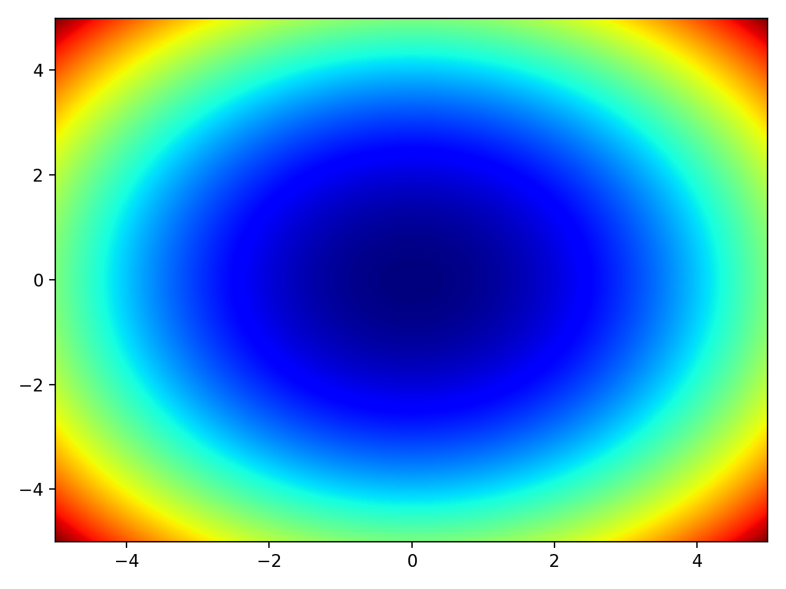
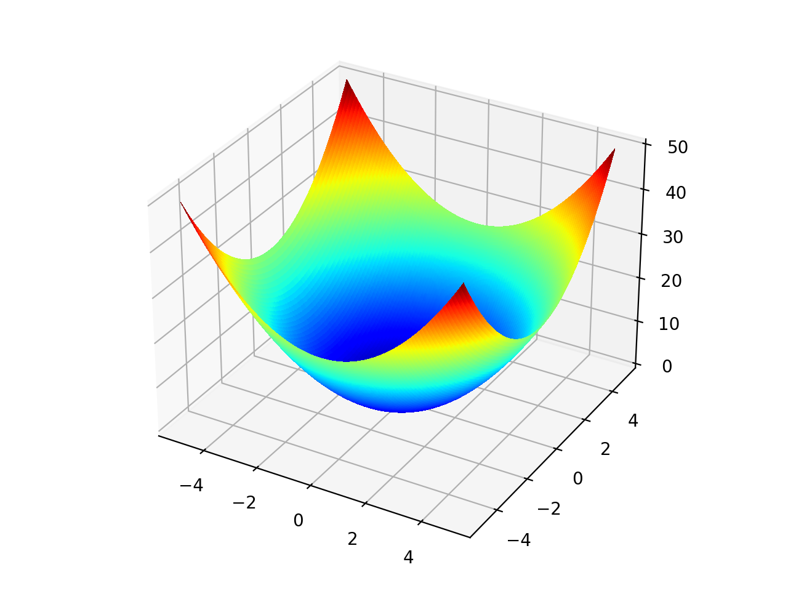

<H1 align="center">
    gradient-free-objective-functions
</H1>

 

<H2 align="center">
    A collection and visualization of black-box objective functions
</H2>

<table style="width:100%">
  <tr>
    <th> <b>Objective Function</b> </th>
    <th> <b>Heatmap</b> </th> 
    <th> <b>Surface Plot</b> </th>
  </tr>
  <tr>
    <th> <ins>Sphere function</ins>     </th>
    <td>  </td>
    <td>  </td>
  </tr>
</table>

