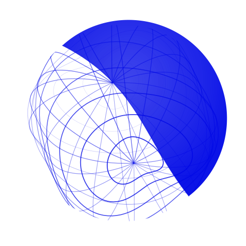
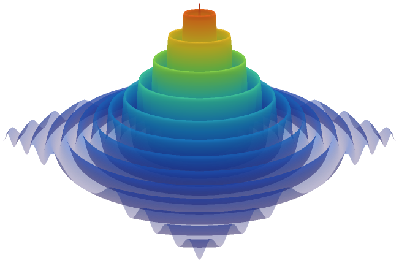

<h1 align="center">
Surfaces
</h1>

<p align="center">
  <a href="https://surfaces.readthedocs.io/en/latest/">
    <picture>
      <source media="(prefers-color-scheme: dark)" srcset="./docs/source/_static/surfaces_logo_dark.svg">
      <source media="(prefers-color-scheme: light)" srcset="./docs/source/_static/surfaces_logo.svg">
      
    </picture>
  </a>
</p>

---

<h3 align="center">
Test functions for benchmarking optimization algorithms in Python.
</h3>

<p align="center">
  <a href="https://github.com/SimonBlanke/Surfaces/actions"></a>
  <a href="https://codecov.io/gh/SimonBlanke/Surfaces"></a>
</p>

<br>

<table align="center">
  <tr>
    <td align="right"><b>Documentation</b></td>
    <td>
      <a href="https://surfaces.readthedocs.io/en/latest/">Homepage</a> ·
      <a href="https://surfaces.readthedocs.io/en/latest/get_started.html">Getting Started</a> ·
      <a href="https://surfaces.readthedocs.io/en/latest/installation.html">Installation</a> ·
      <a href="https://surfaces.readthedocs.io/en/latest/user_guide.html">User Guide</a> ·
      <a href="https://surfaces.readthedocs.io/en/latest/api_reference.html">API Reference</a> ·
      <a href="https://surfaces.readthedocs.io/en/latest/examples.html">Tutorials</a>
    </td>
  </tr>
  <tr>
    <td align="right"><b>On this page</b></td>
    <td>
      <a href="#key-features">Features</a> ·
      <a href="#examples">Examples</a> ·
      <a href="#core-concepts">Concepts</a> ·
      <a href="#ecosystem">Ecosystem</a> ·
      <a href="#contributing">Contributing</a> ·
      <a href="#citation">Citation</a>
    </td>
  </tr>
</table>

<br>

---

<a href="https://surfaces.readthedocs.io/en/latest/">
  
</a>

**Surfaces** is a Python library providing standardized test functions for evaluating and comparing optimization algorithms. It includes algebraic benchmark functions from optimization literature, machine learning hyperparameter optimization problems, and constrained engineering design problems.

Designed for researchers benchmarking new optimization algorithms, practitioners comparing optimizer performance, and educators teaching optimization concepts. All functions provide a consistent interface: callable with dictionary parameters and automatic search space generation.

<p>
  <a href="https://linkedin.com/in/simon-blanke"></a>
  <a href="https://github.com/sponsors/SimonBlanke"></a>
</p>

<br>

## Installation

```bash
pip install surfaces
```

<p>
  <a href="https://pypi.org/project/surfaces/"></a>
  <a href="https://pypi.org/project/surfaces/"></a>
</p>

<details>
<summary>Optional dependencies</summary>

```bash
pip install surfaces[ml]          # Machine learning test functions (scikit-learn)
pip install surfaces[viz]         # Visualization tools (matplotlib, plotly)
pip install surfaces[cec]         # CEC competition benchmarks
pip install surfaces[timeseries]  # Time series functions (sktime)
pip install surfaces[full]        # All optional features
```

</details>

<br>

## Key Features

| [**30+ Algebraic Test Functions**](https://surfaces.readthedocs.io/en/latest/user_guide/test_functions/algebraic/index.html)<br><sub>Classic benchmarks from optimization literature: Sphere, Rastrigin, Ackley, Rosenbrock, and more.</sub> | [**ML Hyperparameter Test Functions**](https://surfaces.readthedocs.io/en/latest/user_guide/test_functions/machine_learning.html)<br><sub>Real hyperparameter optimization problems using scikit-learn models with cross-validation.</sub> | [**Constrained Engineering Test Functions**](https://surfaces.readthedocs.io/en/latest/user_guide/test_functions/engineering.html)<br><sub>Constrained optimization from engineering literature: welded beams, pressure vessels, spring design.</sub> |
| :--- | :--- | :--- |
| [**Surrogate Models**](https://surfaces.readthedocs.io/en/latest/user_guide/surrogates.html)<br><sub>Pre-trained neural networks for fast ML test function evaluation. 100-1000x faster with realistic characteristics.</sub> | [**BBOB and CEC Suites**](https://surfaces.readthedocs.io/en/latest/user_guide/test_functions/bbob.html)<br><sub>Standard academic benchmark suites used in optimization competitions.</sub> | [**Optimizer Integration**](https://surfaces.readthedocs.io/en/latest/user_guide/integrations/index.html)<br><sub>Works with Optuna, Ray Tune, scipy, Gradient-Free-Optimizers and any optimizer that accepts a callable.</sub> |

<br>

## Quick Start

```python
from surfaces.test_functions.algebraic import SphereFunction

# Create a 3-dimensional Sphere function
sphere = SphereFunction(n_dim=3)

# Get the search space (NumPy arrays for each dimension)
print(sphere.search_space)
# {'x0': array([-5.12, ..., 5.12]), 'x1': array([...]), 'x2': array([...])}

# Evaluate at a point
result = sphere({"x0": 0.5, "x1": -0.3, "x2": 0.1})
print(f"Value: {result}")  # Value: -0.35 (negated for maximization)

# Access the global optimum
print(f"Optimum: {sphere.global_optimum}")  # Optimum at origin
```

**Output:**
```
{'x0': array([-5.12, ..., 5.12]), 'x1': array([...]), 'x2': array([...])}
Value: -0.35
Optimum: {'x0': 0.0, 'x1': 0.0, 'x2': 0.0}
```

<br>

## Core Concepts

```
                     SURFACES ARCHITECTURE

    ┌──────────────────┐    ┌──────────────────┐
    │   Test Function  │───>│   Search Space   │
    │   (Algebraic/    │    │   (NumPy arrays  │
    │    ML/Engineer)  │    │    per param)    │
    └──────────────────┘    └──────────────────┘
            │                       │
            v                       v
    ┌─────────────────────────────────────────┐
    │             Modifiers (optional)        │
    │    (Noise, Delay, Transformations)      │
    └─────────────────────────────────────────┘
            │
            v
    ┌─────────────────────────────────────────┐
    │              Optimizer                  │
    │    (Hyperactive, GFO, or any other)     │
    └─────────────────────────────────────────┘
```

**Test Function**: Callable object that evaluates parameter combinations. Returns a score (maximization by default).

**Search Space**: Dictionary mapping parameter names to valid values as NumPy arrays. Generated automatically from function bounds.

**Modifiers**: Optional pipeline of transformations (noise, delay) applied to function evaluations.

**Optimizer**: Any algorithm that can call the function with parameters from the search space.

<br>

## Examples

<details open>
<summary><b>Algebraic Functions</b></summary>

```python
from surfaces.test_functions.algebraic import (
    SphereFunction,
    RastriginFunction,
    AckleyFunction,
)

# Simple unimodal function
sphere = SphereFunction(n_dim=5)
print(sphere({"x0": 0, "x1": 0, "x2": 0, "x3": 0, "x4": 0}))  # Optimum: 0

# Highly multimodal function with many local optima
rastrigin = RastriginFunction(n_dim=3)
print(f"Search space bounds: {rastrigin.default_bounds}")

# Challenging function with a narrow global basin
ackley = AckleyFunction()  # 2D by default
print(f"Global optimum at: {ackley.x_global}")
```

</details>


<details>
<summary><b>Machine Learning Functions</b></summary>

```python
from surfaces.test_functions.machine_learning.hyperparameter_optimization.tabular import (
    KNeighborsClassifierFunction,
    RandomForestClassifierFunction,
)

# KNN hyperparameter optimization on iris dataset
knn = KNeighborsClassifierFunction(dataset="iris", cv=5)
print(knn.search_space)
# {'n_neighbors': [3, 5, 7, ...], 'algorithm': ['auto', 'ball_tree', ...]}

accuracy = knn({"n_neighbors": 5, "algorithm": "auto"})
print(f"CV Accuracy: {accuracy:.4f}")

# Random Forest on wine dataset
rf = RandomForestClassifierFunction(dataset="wine", cv=3)
score = rf({"n_estimators": 100, "max_depth": 5, "min_samples_split": 2})
```

</details>


<details>
<summary><b>Engineering Functions</b></summary>

```python
from surfaces.test_functions.algebraic.constrained import (
    WeldedBeamFunction,
    PressureVesselFunction,
)

# Welded beam design optimization
beam = WeldedBeamFunction()
cost = beam({"h": 0.2, "l": 6.0, "t": 8.0, "b": 0.3})
print(f"Fabrication cost: {cost}")

# Pressure vessel design
vessel = PressureVesselFunction()
print(f"Design variables: {list(vessel.search_space.keys())}")
```

</details>


<details>
<summary><b>Using Modifiers</b></summary>

```python
from surfaces.test_functions.algebraic import SphereFunction
from surfaces.modifiers import DelayModifier, GaussianNoise

# Add realistic conditions to any function
sphere = SphereFunction(
    n_dim=2,
    modifiers=[
        DelayModifier(delay=0.01),         # Simulate expensive evaluation
        GaussianNoise(sigma=0.1, seed=42)  # Add measurement noise
    ]
)

# Evaluate with modifiers applied
noisy_result = sphere({"x0": 1.0, "x1": 2.0})

# Get the true value without modifiers
true_value = sphere.true_value({"x0": 1.0, "x1": 2.0})
print(f"Noisy: {noisy_result:.4f}, True: {true_value:.4f}")
```

</details>


<details>
<summary><b>Surrogate Models</b></summary>

```python
from surfaces.test_functions.machine_learning import KNeighborsClassifierFunction

# Real evaluation (slow but accurate)
func_real = KNeighborsClassifierFunction(dataset="digits", cv=5, use_surrogate=False)

# Surrogate evaluation (1000x faster)
func_fast = KNeighborsClassifierFunction(dataset="digits", cv=5, use_surrogate=True)

# Same interface, dramatically different speed
result_real = func_real({"n_neighbors": 5, "algorithm": "auto"})  # ~100ms
result_fast = func_fast({"n_neighbors": 5, "algorithm": "auto"})  # ~0.1ms

# Surrogates capture realistic ML landscape characteristics:
# multi-modality, hyperparameter interactions, plateaus
```

</details>


<details>
<summary><b>Benchmark Suites</b></summary>

```python
from surfaces.test_functions.benchmark.bbob import (
    Sphere as BBOBSphere,
    RosenbrockOriginal as BBOBRosenbrock,
)

# BBOB (Black-Box Optimization Benchmarking) functions
# Used in COCO platform for algorithm comparison
bbob_sphere = BBOBSphere(n_dim=10)
bbob_rosenbrock = BBOBRosenbrock(n_dim=10)

print(f"BBOB Sphere f_global: {bbob_sphere.f_global}")
```

</details>


<details>
<summary><b>Multi-Objective Functions</b></summary>

```python
from surfaces.test_functions.algebraic.multi_objective import (
    ZDT1,
    Kursawe,
)

# ZDT1: Two-objective problem with convex Pareto front
zdt1 = ZDT1(n_dim=3)
params = {f"x{i}": 0.5 for i in range(3)}
objectives = zdt1(params)  # Returns tuple of objectives
print(f"ZDT1 objectives: {objectives}")

# Kursawe: Non-convex Pareto front
kursawe = Kursawe()
f1, f2 = kursawe({"x0": 0.0, "x1": 0.0, "x2": 0.0})
print(f"Kursawe objectives: f1={f1:.4f}, f2={f2:.4f}")
```

</details>


<details>
<summary><b>Integration with Optimizers</b></summary>

```python
from surfaces.test_functions.algebraic import AckleyFunction

# Surfaces works with any optimizer accepting callable + search space
func = AckleyFunction()

# Example with Hyperactive
from hyperactive import Hyperactive

hyper = Hyperactive()
hyper.add_search(func, func.search_space, n_iter=100)
hyper.run()

print(f"Best score: {hyper.best_score(func)}")
print(f"Best params: {hyper.best_para(func)}")

# Example with Gradient-Free-Optimizers
from gradient_free_optimizers import BayesianOptimizer

opt = BayesianOptimizer(func.search_space)
opt.search(func, n_iter=50)
```

</details>

<br>

## Ecosystem

This library is part of a suite of optimization tools. For updates, [follow on GitHub](https://github.com/SimonBlanke).

| Package | Description |
|---------|-------------|
| [Hyperactive](https://github.com/SimonBlanke/Hyperactive) | Hyperparameter optimization framework with experiment abstraction and ML integrations |
| [Gradient-Free-Optimizers](https://github.com/SimonBlanke/Gradient-Free-Optimizers) | Core optimization algorithms for black-box function optimization |
| [Surfaces](https://github.com/SimonBlanke/Surfaces) | Test functions and benchmark surfaces for optimization algorithm evaluation |

<br>

## Documentation

| Resource | Description |
|----------|-------------|
| [User Guide](https://github.com/SimonBlanke/Surfaces#usage) | Installation and basic usage examples |
| [API Reference](https://github.com/SimonBlanke/Surfaces#function-categories) | Complete list of available test functions |
| [Examples](https://github.com/SimonBlanke/Surfaces#examples) | Code examples for common use cases |
| [GitHub Issues](https://github.com/SimonBlanke/Surfaces/issues) | Bug reports and feature requests |

<br>

## Contributing

Contributions welcome! See [CONTRIBUTING.md](./CONTRIBUTING.md) for guidelines.

- **Bug reports**: [GitHub Issues](https://github.com/SimonBlanke/Surfaces/issues)
- **Feature requests**: [GitHub Discussions](https://github.com/SimonBlanke/Surfaces/discussions)
- **Questions**: [GitHub Issues](https://github.com/SimonBlanke/Surfaces/issues)

<br>

## Citation

If you use this software in your research, please cite:

```bibtex
@software{surfaces2024,
  author = {Simon Blanke},
  title = {Surfaces: Test functions for optimization algorithm benchmarking},
  year = {2024},
  url = {https://github.com/SimonBlanke/Surfaces},
  version = {0.6.1}
}
```

<br>

## License

[MIT License](./LICENSE) - Free for commercial and academic use.
