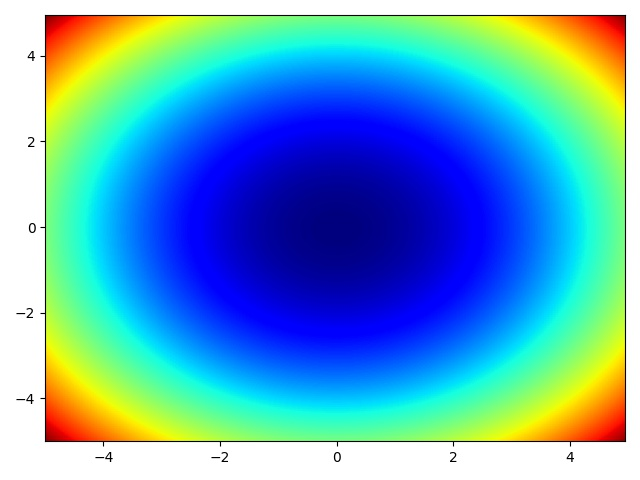
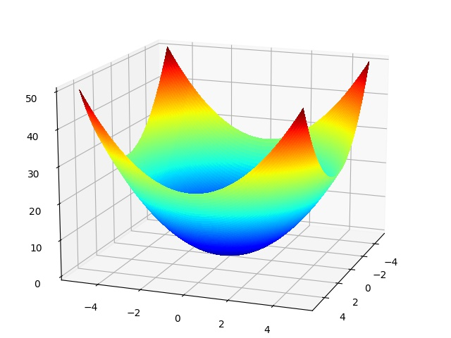
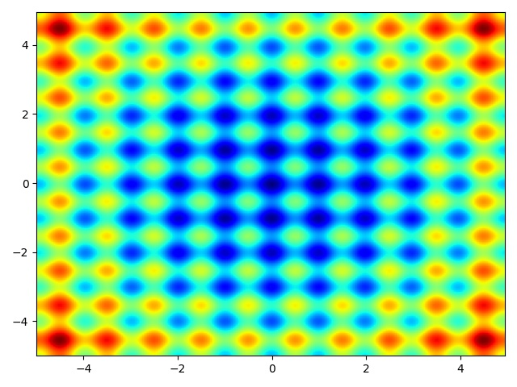
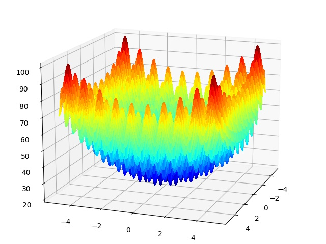
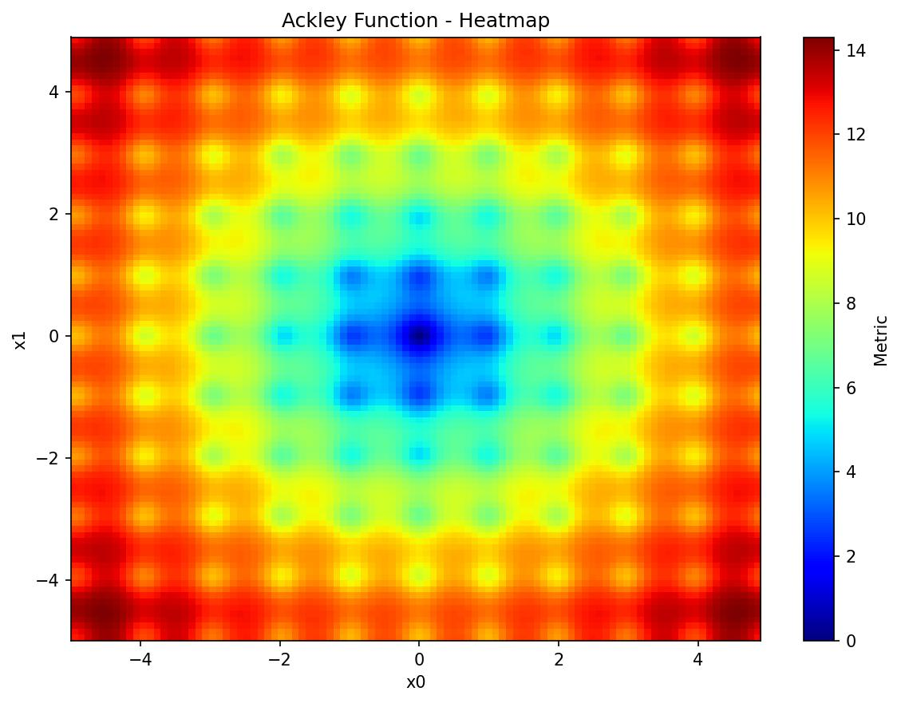
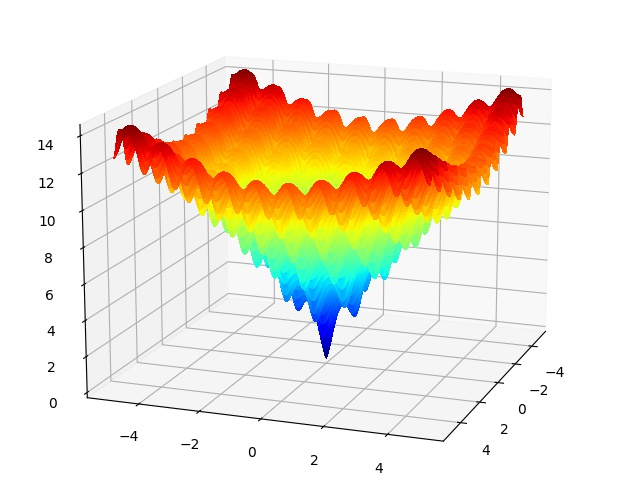
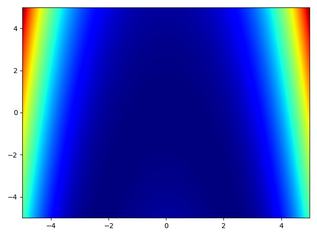
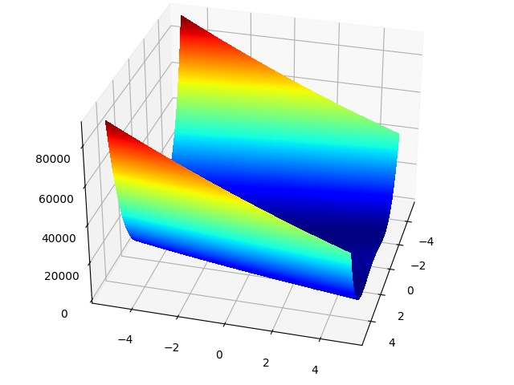
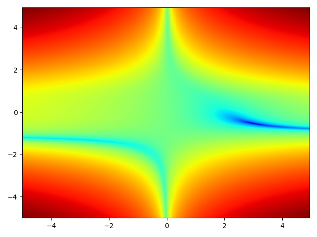
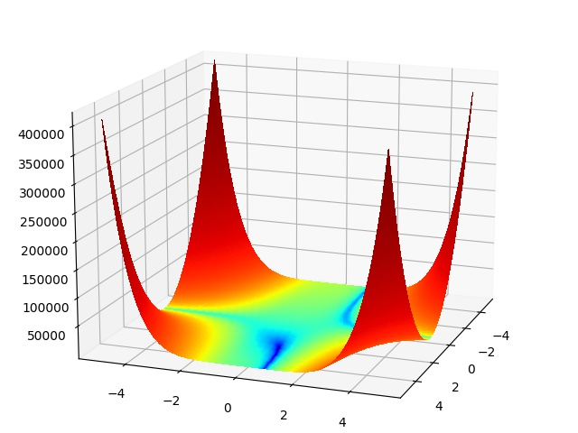

<H1 align="center">
    Black-box Objective-functions
</H1>

<br>

<H2 align="center">
    A collection and visualization of black-box objective functions
</H2>


<br>

## Visualizations

<table style="width:100%">
  <tr>
    <th> <b>Objective Function</b> </th>
    <th> <b>Heatmap</b> </th> 
    <th> <b>Surface Plot</b> </th>
  </tr>
  <tr>
    <th> <ins>Sphere function</ins> <br><br>  </th>
    <td>  </td>
    <td>  </td>
  </tr>
  <tr>
    <th> <ins>Rastrigin function</ins> <br><br> </th>
    <td>  </td>
    <td>  </td>
  </tr>
  <tr>
    <th> <ins>Ackley function</ins> <br><br> </th>
    <td>  </td>
    <td>  </td>
  </tr>
  <tr>
    <th> <ins>Rosenbrock function</ins> <br><br> </th>
    <td>  </td>
    <td>  </td>
  </tr>
  <tr>
    <th> <ins>Beale function</ins> <br><br> </th>
    <td>  </td>
    <td>  </td>
  </tr>
</table>


<br>

## Installation

The most recent version of Black-box Objective-functions is available on PyPi:

```console
pip install black-box-objective-functions
```

## Example
```python
import numpy as np

from bbox_functions.convex import SphereFunction
from bbox_functions.non_convex import AckleyFunction
from bbox_functions.visualize import plotly_surface


sphere_function = SphereFunction(n_dim=2, metric="score")
ackley_function = AckleyFunction(metric="loss")


step_ = 0.05
min_ = 10
max_ = 10
search_space = {
    "x0": np.arange(-min_, max_, step_),
    "x1": np.arange(-min_, max_, step_),
}

plotly_surface(sphere_function, search_space).show()
plotly_surface(ackley_function, search_space).show()
```


<br>

## API reference

#### Objective Function Classes

All objective function classes have the following parameters:
- metric: "score" or "loss"
- parameter_type: "dictionary" or "arrays"

Each objective function class has the following parameters:

<details>
<summary>SphereFunction</summary>
    
- A = 1
    
</details>

<details>
<summary>AckleyFunction</summary>
    
- A = 20
- B = 2 * pi
    
</details>

<details>
<summary>RastriginFunction</summary>
    
- A = 10
- B = 2 * pi
    
</details>

<details>
<summary>RosenbrockFunction</summary>
    
- A = 1
- B = 100
    
</details>

<details>
<summary>BealeFunction</summary>
    
- A = 1.5
- B = 2.25
- C = 2.652
    
</details>

<details>
<summary>HimmelblausFunction</summary>
    
- A = -11
- B = -7
    
</details>

<details>
<summary>HölderTableFunction</summary>
    
- A = 10
- B = 1
    
</details>

<details>
<summary>CrossInTrayFunction</summary>
    
- A = -0.0001
- B = 100
- 
</details>


