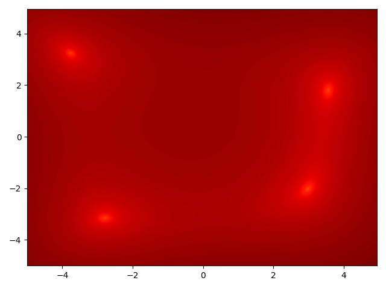
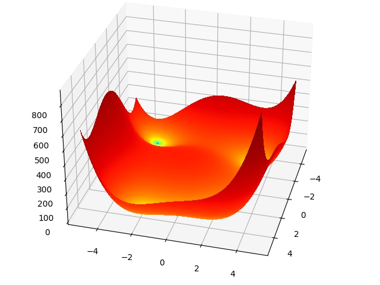
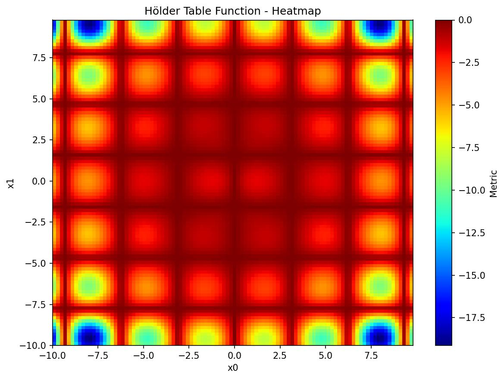
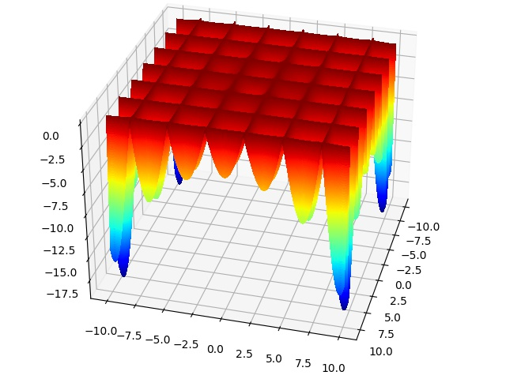
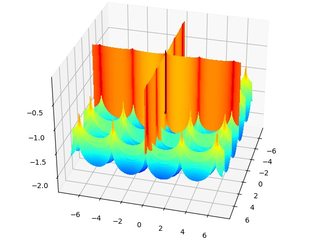

<H1 align="center">
    Surfaces
</H1>

<br>

<H2 align="center">
    A collection and visualization of single objective black-box functions for optimization benchmarking
</H2>


<br>

## Visualizations

<table style="width:100%">
  <tr>
    <th> <b>Objective Function</b> </th>
    <th> <b>Heatmap</b> </th> 
    <th> <b>Surface Plot</b> </th>
  </tr>
  <tr>
    <th> <ins>Sphere function</ins> <br><br>  </th>
    <td>  </td>
    <td>  </td>
  </tr>
  <tr>
    <th> <ins>Rastrigin function</ins> <br><br> </th>
    <td>  </td>
    <td>  </td>
  </tr>
  <tr>
    <th> <ins>Ackley function</ins> <br><br> </th>
    <td>  </td>
    <td>  </td>
  </tr>
  <tr>
    <th> <ins>Rosenbrock function</ins> <br><br> </th>
    <td>  </td>
    <td>  </td>
  </tr>
  <tr>
    <th> <ins>Beale function</ins> <br><br> </th>
    <td>  </td>
    <td>  </td>
  </tr>
  <tr>
    <th> <ins>Himmelblaus function</ins> <br><br> </th>
    <td>  </td>
    <td>  </td>
  </tr>
  <tr>
    <th> <ins>Hölder Table function</ins> <br><br> </th>
    <td>  </td>
    <td>  </td>
  </tr>
  <tr>
    <th> <ins>Cross-In-Tray function</ins> <br><br> </th>
    <td>  </td>
    <td>  </td>
  </tr>
</table>


<br>

## Installation

The most recent version of Surfaces is available on PyPi:

```console
pip install surfaces
```

## Example
```python
import numpy as np

from surfaces.mathematical_functions import SphereFunction, AckleyFunction
from surfaces.visualize import plotly_surface


sphere_function = SphereFunction(n_dim=2, metric="score")
ackley_function = AckleyFunction(metric="loss")


step_ = 0.05
min_ = 10
max_ = 10
search_space = {
    "x0": np.arange(-min_, max_, step_),
    "x1": np.arange(-min_, max_, step_),
}

plotly_surface(sphere_function, search_space).show()
plotly_surface(ackley_function, search_space).show()
```

