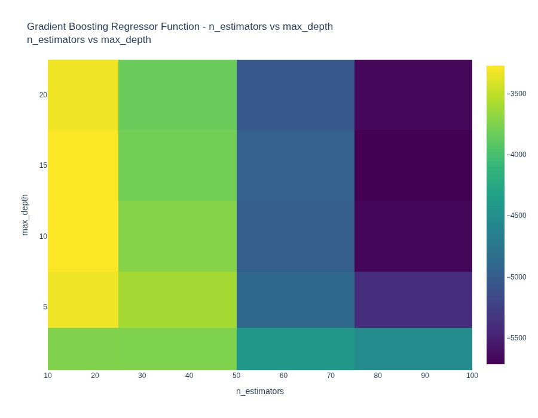

<H1 align="center">
    Surfaces
</H1>

<br>

<H2 align="center">
    A collection and visualization of single objective black-box functions for optimization benchmarking
</H2>


<br>

## Visualizations

### Mathematical Functions

<table style="width:100%">
  <tr>
    <th> <b>Objective Function</b> </th>
    <th> <b>Heatmap</b> </th> 
    <th> <b>Surface Plot</b> </th>
  </tr>
  <tr>
    <th> <ins>Sphere function</ins> <br><br>  </th>
    <td>  </td>
    <td>  </td>
  </tr>
  <tr>
    <th> <ins>Rastrigin function</ins> <br><br> </th>
    <td>  </td>
    <td>  </td>
  </tr>
  <tr>
    <th> <ins>Ackley function</ins> <br><br> </th>
    <td>  </td>
    <td>  </td>
  </tr>
  <tr>
    <th> <ins>Rosenbrock function</ins> <br><br> </th>
    <td>  </td>
    <td>  </td>
  </tr>
  <tr>
    <th> <ins>Beale function</ins> <br><br> </th>
    <td>  </td>
    <td>  </td>
  </tr>
  <tr>
    <th> <ins>Himmelblaus function</ins> <br><br> </th>
    <td>  </td>
    <td>  </td>
  </tr>
  <tr>
    <th> <ins>Hölder Table function</ins> <br><br> </th>
    <td>  </td>
    <td>  </td>
  </tr>
  <tr>
    <th> <ins>Cross-In-Tray function</ins> <br><br> </th>
    <td>  </td>
    <td>  </td>
  </tr>
</table>

### Machine Learning Functions

Surfaces also provides powerful visualizations for machine learning test functions, showing hyperparameter interactions and dataset-specific performance patterns.

<table style="width:100%">
  <tr>
    <th> <b>ML Function</b> </th>
    <th> <b>Hyperparameter Interactions</b> </th> 
    <th> <b>Dataset Performance Analysis</b> </th>
  </tr>
  <tr>
    <th> <ins>K-Neighbors Classifier</ins> <br><br>
         <small>Shows how n_neighbors and algorithm<br>
         interact to affect classification<br>
         performance across different datasets</small>
    </th>
    <td> 
      
      <br><small>Darker regions indicate better performance combinations</small>
    </td>
    <td> 
      
      <br><small>Shows optimal n_neighbors varies by dataset</small>
    </td>
  </tr>
  <tr>
    <th> <ins>Gradient Boosting Regressor</ins> <br><br>
         <small>Demonstrates the interaction between<br>
         n_estimators and max_depth parameters<br>
         for regression tasks</small>
    </th>
    <td> 
      
      <br><small>Reveals sweet spots in hyperparameter space</small>
    </td>
    <td> 
      
      <br><small>Shows max_depth sensitivity across datasets</small>
    </td>
  </tr>
</table>

#### ML Visualization Features

- **🔧 Hyperparameter Interactions**: Visualize how different hyperparameters interact and affect model performance
- **📊 Dataset Sensitivity**: Understand how hyperparameters perform across different datasets
- **🎯 Optimal Regions**: Identify sweet spots in hyperparameter space
- **📈 Performance Patterns**: Discover dataset-specific optimization strategies

<br>

## Installation

The most recent version of Surfaces is available on PyPi:

```console
pip install surfaces
```

## Example
```python
import numpy as np

from surfaces.test_functions.mathematical import SphereFunction, AckleyFunction
from surfaces.visualize import plotly_surface


sphere_function = SphereFunction(n_dim=2, metric="score")
ackley_function = AckleyFunction(metric="loss")


step_ = 0.05
min_ = 10
max_ = 10
search_space = {
    "x0": np.arange(-min_, max_, step_),
    "x1": np.arange(-min_, max_, step_),
}

plotly_surface(sphere_function.objective_function, search_space).show()
plotly_surface(ackley_function.objective_function, search_space).show()
```

### ML Function Visualization Example

```python
from surfaces.test_functions.machine_learning.tabular.classification.test_functions import KNeighborsClassifierFunction
from surfaces.visualize import plotly_ml_hyperparameter_heatmap, plotly_dataset_hyperparameter_analysis

# Create ML function
knn_func = KNeighborsClassifierFunction(metric="accuracy")

# 1. Hyperparameter interaction analysis
fig1 = plotly_ml_hyperparameter_heatmap(
    knn_func, 
    'n_neighbors', 
    'algorithm',
    title="KNN: Hyperparameter Interactions"
)
fig1.show()

# 2. Dataset sensitivity analysis  
fig2 = plotly_dataset_hyperparameter_analysis(
    knn_func,
    'n_neighbors', 
    title="KNN: Performance Across Datasets"
)
fig2.show()
```

## Search Data Collection for Machine Learning Functions

Surfaces includes a powerful search data collection system for machine learning test functions that enables fast evaluation and benchmarking of optimization algorithms. This feature pre-computes and stores evaluation results across parameter grids, providing instant lookups instead of expensive ML model training.

### Key Benefits

- ** Fast evaluations**: 100-1000x speedup for ML function evaluations
- ** Timing data included**: Original evaluation times preserved for realistic benchmarking  
- ** SQLite storage**: Lightweight, dependency-free database storage
- ** Easy to use**: Simple API integrated with existing ML test functions

### Quick Start

```python
from surfaces.test_functions.machine_learning.tabular.regression.test_functions import GradientBoostingRegressorFunction

# Create ML function
ml_func = GradientBoostingRegressorFunction()

# Collect search data (one-time setup)
ml_func.collect_search_data()

# Now use fast evaluation mode
fast_func = GradientBoostingRegressorFunction(evaluate_from_data=True)

# Lightning-fast evaluation (uses stored data)
params = {'n_estimators': 50, 'max_depth': 5, 'cv': 3, 'dataset': ml_func.dataset_default[0]}
result = fast_func.evaluate(params)  # ~1000x faster than normal evaluation
```

### Benchmarking with Timing Data

Perfect for testing optimization algorithms within time budgets:

```python
# Get timing statistics for realistic benchmarking
timing_stats = ml_func.get_timing_statistics()
print(f"Average evaluation time: {timing_stats['average_time']:.4f}s")
print(f"Total time budget: {timing_stats['total_time']:.2f}s")

# Simulate algorithm testing within time constraints
budget_seconds = 60.0
evaluations_possible = int(budget_seconds / timing_stats['average_time'])
print(f"Can test ~{evaluations_possible} parameter combinations in {budget_seconds}s")
```

### Command-Line Usage

Use the included command-line utility for batch data collection:

```bash
# Collect data for all ML functions
python collect_ml_search_data.py --all

# Collect for specific function
python collect_ml_search_data.py gradient_boosting_regressor

# Check collection status
python collect_ml_search_data.py --list

# Use custom batch size for memory efficiency
python collect_ml_search_data.py --batch-size 50 --all
```

### Advanced Usage

**Custom Search Spaces:**
```python
# Define custom parameter ranges
custom_space = {
    'n_estimators': [50, 100, 150],
    'max_depth': [3, 5, 7, 10],
    'cv': [3, 5],
    'dataset': ml_func.dataset_default[:2]  # Use subset of datasets
}

ml_func.collect_search_data(search_space=custom_space)
```

**Collection Status and Management:**
```python
# Check collection status
status = ml_func.get_search_data_status()
print(f"Coverage: {status['completion_percentage']:.1f}%")
print(f"Stored: {status['stored_evaluations']}/{status['total_combinations']}")

# Clear stored data if needed
ml_func.clear_search_data()
```

### Available ML Functions

- `GradientBoostingRegressorFunction` - Gradient boosting for regression
- `KNeighborsRegressorFunction` - K-nearest neighbors regression  
- `KNeighborsClassifierFunction` - K-nearest neighbors classification

### How It Works

1. **Data Collection Phase**: ML function is evaluated across all parameter combinations in its search space
2. **Storage**: Results stored in SQLite database with timing information
3. **Fast Evaluation**: Lookups return pre-computed results instantly
4. **Benchmarking**: Original timing data enables realistic algorithm testing

The system automatically handles:
- Parameter grid generation
- Database indexing for fast lookups
- Function object serialization
